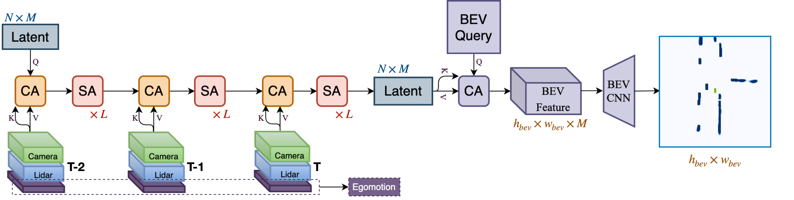
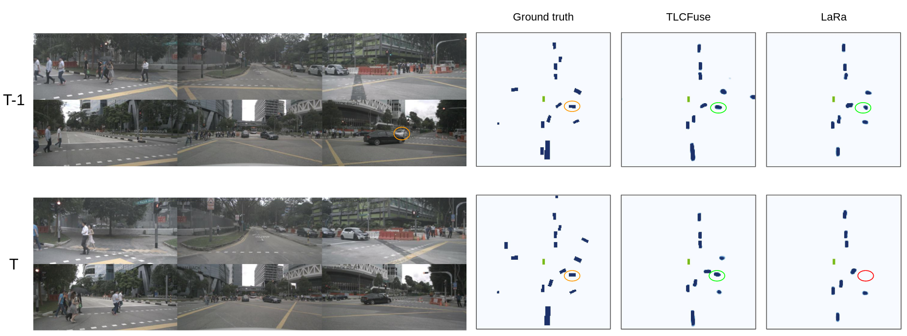

# TLCFuse
We propose a novel approach for bird’s eye view semantic grid prediction that leverages sequential sensor data to achieve robustness against occlusions. Our model extracts information from the sensor readings using attention operations and aggregates this information into a lower-dimensional latent representation, enabling thus the processing of multi-step inputs at each prediction step. Additionally, we show how the model can be used with multimodal input sources and how it can also be directly applied to forecast the development of traffic scenes. We evaluate our model on the nuScenes dataset and show that it outperforms all competing multimodal methods on the vehicle segmentation task, with particularly large differences when evaluating on occluded and partially-occluded vehicles.

Architecture: 

## Qualitative results:

### Predicting current time frame:

