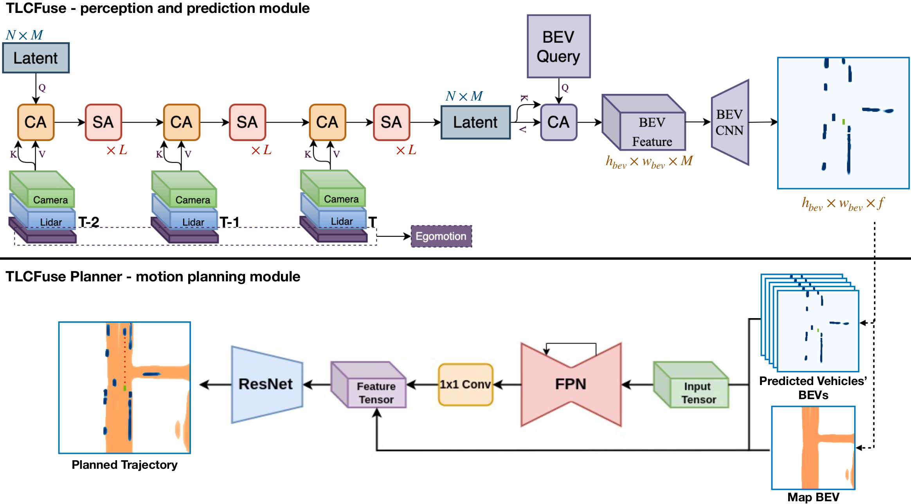
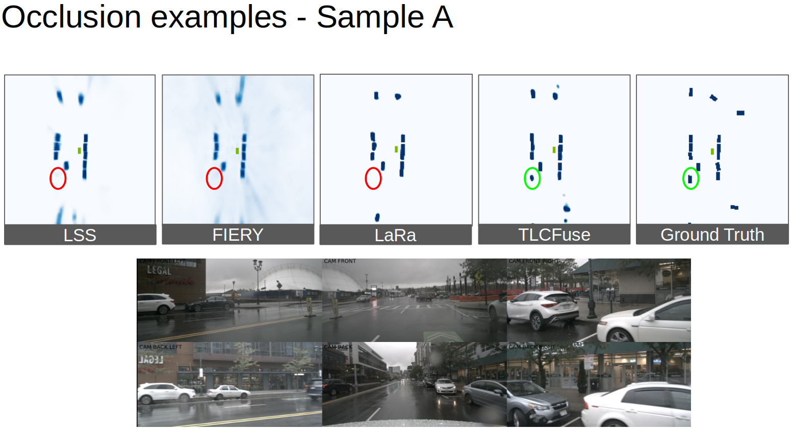
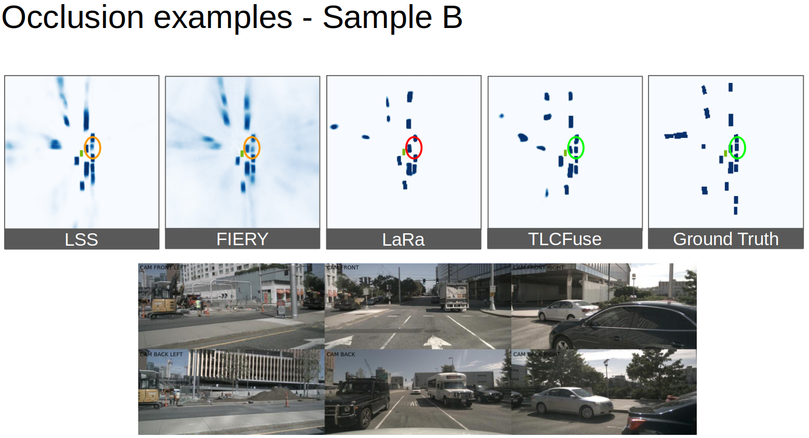
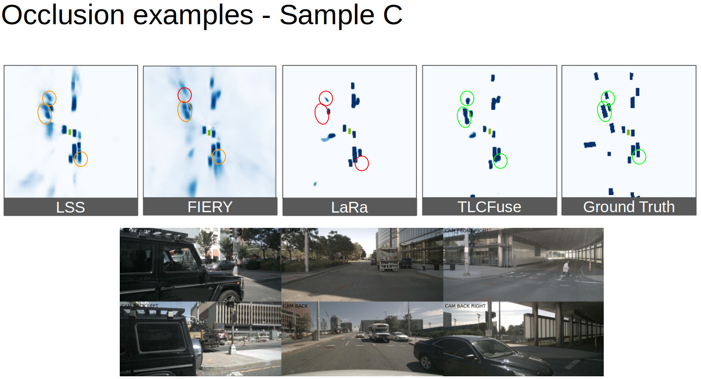
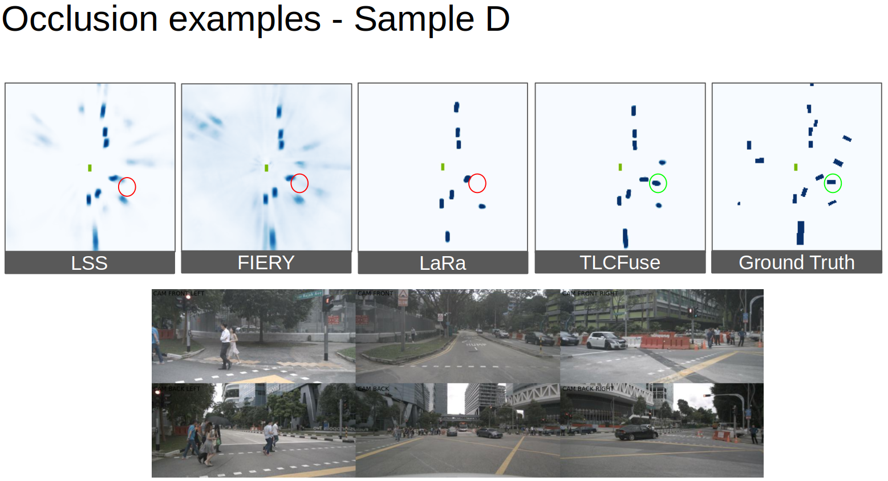
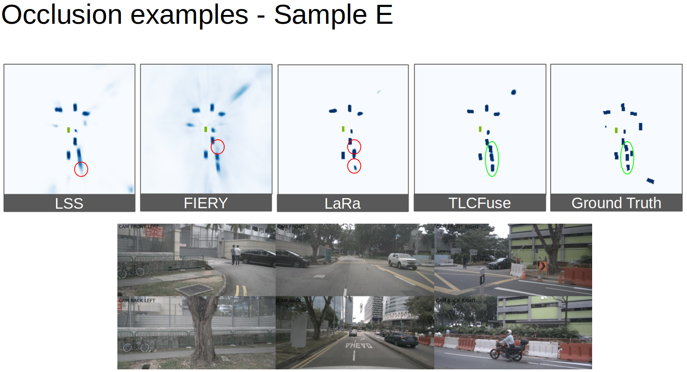
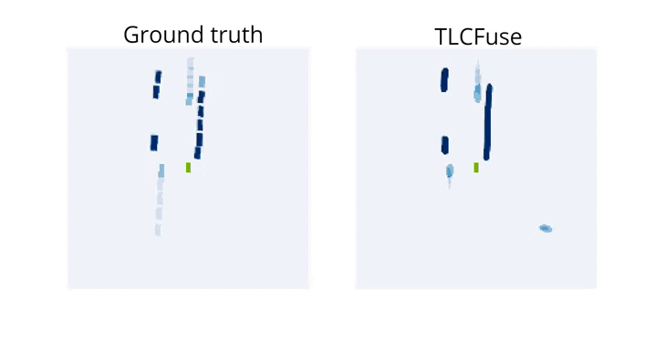

# TLCFuse
We propose a novel approach for bird's eye view semantic grid segmentation, that leverages sequential sensor data to achieve robustness against occlusions. Our model extracts information from the sensor readings using attention operations and aggregates this information into a lower-dimensional latent representation, enabling thus the processing of multi-step inputs at each prediction step. Moreover, we show how it can also be directly applied to forecast the development of traffic scenes and be seamlessly integrated into a motion planner for trajectory planning. On the semantic segmentation tasks, we evaluate our model on the nuScenes dataset and show that it outperforms other baselines, with particularly large differences when evaluating on occluded and partially-occluded vehicles. Additionally, on motion planning task we are among the early teams to train and evaluate on nuPlan, a cutting-edge large-scale dataset for motion planning.

Architecture: 

## Qualitative results:

### Predicting current time frame:
Sample A:

Sample B: 

sample C:

Sample D: 

Sample E:

### PLanning
[![Planning]](https://youtu.be/-tTrlZeFsvs)

### Predicting future frames:
 

